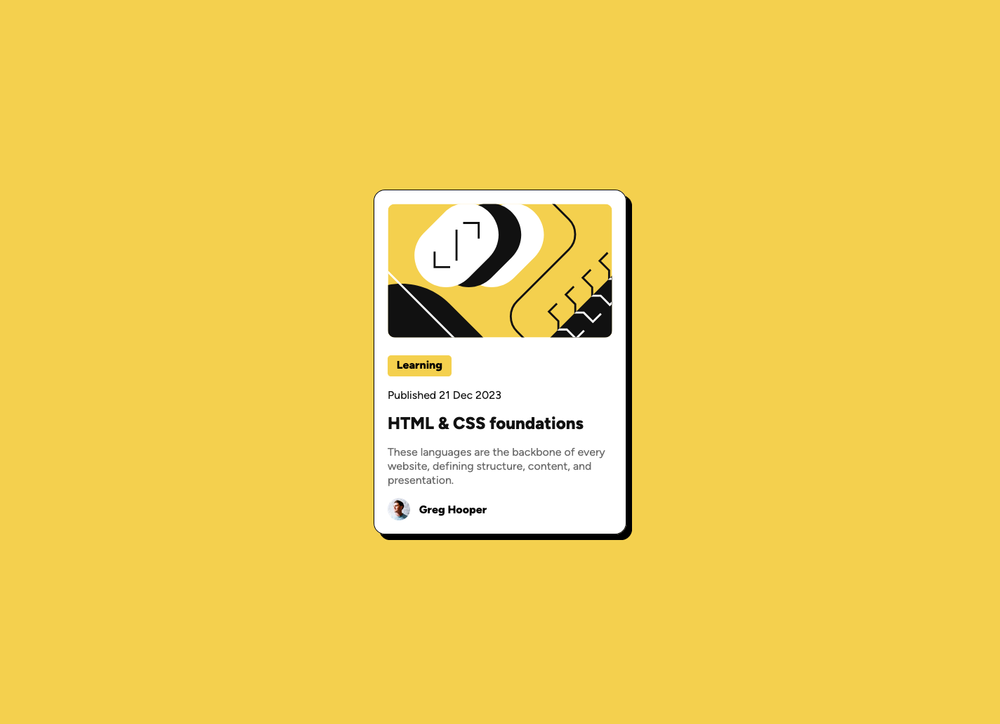

# Frontend Mentor - Blog preview card solution

This is a solution to the [Blog preview card challenge on Frontend Mentor](https://www.frontendmentor.io/challenges/blog-preview-card-ckPaj01IcS). Frontend Mentor challenges help you improve your coding skills by building realistic projects. 

## Table of contents

- [Overview](#overview)
  - [The challenge](#the-challenge)
  - [Screenshot](#screenshot)
  - [Links](#links)
- [My process](#my-process)
  - [Built with](#built-with)
  - [What I learned](#what-i-learned)
  - [Useful resources](#useful-resources)
- [Author](#author)

**Note: Delete this note and update the table of contents based on what sections you keep.**

## Overview

### The challenge

Users should be able to:

- See hover and focus states for all interactive elements on the page

### Screenshot

### Links

- Solution URL: [Add solution URL here](https://github.com/remchouette-cloud/effective-eureka)
- Live Site URL: [Add live site URL here](https://remchouette-cloud.github.io/effective-eureka/)

## My process

### Built with

- Semantic HTML5 markup
- CSS custom properties
- Flexbox

### What I learned

J'ai appris à gérer un projet un peu plus complexe; les différences entre "inline", "block", "flex".
Les problèmes de propriétés héritées qu'on oublie.

### Useful resources

- [Tutoriel d'Aurélien Gérits](https://codepen.io/aurelien-gerits/pen/jENBNKV) - This helped me to create the hover effect (underlining effect)

## Author

- Frontend Mentor - [@remchouette-cloud](https://www.frontendmentor.io/profile/remchouette-cloud)